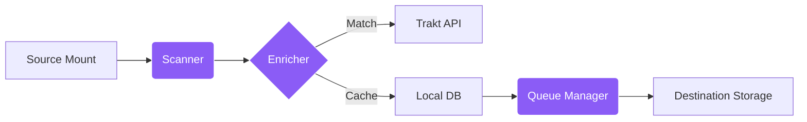

<div align="center">


  
  

</div>
<div align="center">

[](#what-is-copycat)
[](#interface-overview)
[](#quick-start-docker-command)
[](docs/deployment.md)
[](docs/configuration.md)
[](#technical-overview)
[](#roadmap)
[](#support-copycats-development)

</div>

---

## 😸 What is CopyCat? 

**CopyCat** is a self-hosted media management tool for digital libraries. It bridges the gap between **Cloud Storage** (such as Zurg or Rclone mounts) and **Local Storage** (HDD/NAS).

CopyCat provides a web interface to scan, organize, and copy media files across different storage locations.

## 😻 Interface Overview

<p align="center">
  
</p>

<br>

<details>
<summary><strong>📸 View More Screenshots</strong></summary>

### Media Library
Browse content through a categorized interface. Filter by movies or TV shows, view metadata, and select items for transfer. 

<div align="center">
  
  <p><em>Media Library View</em></p>
</div>

### Copy Wizard
Prefer a traditional view? The Copy Wizard offers a familiar file explorer interface, allowing you to manually navigate directory structures and define precise destinations for your transfers.

<div align="center">
  
  <p><em>File Explorer & Copy Wizard</em></p>
</div>

### Transfer Queue
Monitor active transfers in real-time. View detailed progress, transfer speeds, and manage your queue with priority controls to ensure your most important media is ready when you are.

<div align="center">
  
  <p><em>Live Transfer Queue</em></p>
</div>

</details>

### 😺 File Scanning
Navigate mounts as an organized library. CopyCat identifies media files and filters out secondary files like samples and metadata documents.

### 😼 Transfer Queue
Monitor and manage file transfers. The queue manager handles process tracking and ensures operations continue even after the browser is closed.

### 😼 Roadmap
- [x] Nuxt 3 + FastAPI Core
- [x] Multi-stage Docker Builds & Healthchecks
- [x] Metadata Enrichment (Trakt)
- [x] Multi-user login / Permissions
- [ ] tbd
- [ ] tbd

---

## 😸 Quick Start (Docker Command)
Run CopyCat with this single Docker command:

```bash
docker run -d --name copycat -p 4222:3000 -p 4223:8000 -v "$(pwd)/data":/data -v /path/to/source:/mnt/source:ro -v /path/to/destination:/mnt/destination -e JWT_SECRET_KEY=change_this_to_secure_random_string ghcr.io/woahai321/copy-cat:main
```

> [!TIP]
> **Access the App**: The Web Interface is at `http://localhost:4222` and the API at `http://localhost:4223`. Login with <kbd>admin</kbd> / <kbd>changeme</kbd>.

---

## 😽 Deployment

<details>
<summary><strong>Deployment Instructions</strong></summary>

CopyCat is deployed using Docker.

### 1. Requirements
- A machine running Docker & Docker Compose.
- A **Source Path** (e.g., `/mnt/zurg` or any folder with media).
- A **Destination Path** (e.g., `/mnt/media` where you want files to go).

### 2. Setup
Clone the repo and configure your environment:

```bash
git clone https://github.com/woahai321/copy-cat.git
cd copy-cat
cp .env.example .env
```

### 3. Configure
Edit `.env` to match your paths:

```ini
# Where your media is getting READ from (ReadOnly recommended)
SOURCE_PATH=/mnt/zurg

# Where you want your media COPIED to
DESTINATION_PATH=/mnt/local/media

# Security: Set a strong random password!
JWT_SECRET_KEY=change_me_to_something_secure
```

> [!CAUTION]
> **Production Security**: Ensure the `JWT_SECRET_KEY` is a unique, randomly generated string. Do not use the default value in public deployments.


### 4. Launch
```bash
docker-compose up -d
```

### 5. Login
- **Web Interface**: `http://localhost:4222`
- **Backend API**: `http://localhost:4223/api/docs`
- **User**: `admin`
- **Password**: `changeme`

> **Need more help?** Check out the [Deployment Guide](docs/deployment.md) or [Configuration Reference](docs/configuration.md).

</details>


## 🙀 Technical Overview



1.  **Scanner**: Reads the `SOURCE_PATH` and identifies media files. It uses regex to remove unnecessary tags and extracts titles and dates.
2.  **Enricher**: If a **Trakt Client ID** is configured, CopyCat retrieves posters and metadata from Trakt. Images are cached locally to minimize API requests.
3.  **Queue**: Selected files are added to a background queue for transfer to the `DESTINATION_PATH`.


## 😺 Documentation
- [Deployment Guide](docs/deployment.md)
- [Configuration Reference](docs/configuration.md)
- [Developer Guide](docs/development.md)


## 😺 Support CopyCat's Development
If CopyCat saves you time, consider sponsoring:

➡️ [GitHub Sponsors](https://github.com/sponsors/woahai321)

Thank you.


## 🐱 Contributing
Welcome! See [Developer Guide](docs/development.md) for Nuxt + FastAPI setup.


## 🐱 License
[MIT License](LICENSE)


## Star History
<a href="https://star-history.com/#woahai321/copy-cat&Date">
  <picture>
    <source media="(prefers-color-scheme: dark)" srcset="https://api.star-history.com/svg?repos=woahai321/copy-cat&type=Date&theme=dark" />
    <source media="(prefers-color-scheme: light)" srcset="https://api.star-history.com/svg?repos=woahai321/copy-cat&type=Date" />
    
  </picture>
</a>
