<div align="center">


</div>

---

## 🐱 What is CopyCat? 

**CopyCat** is a powerful file management system designed to bridge the gap between your cloud storage (Zurg/Real-Debrid) and local storage. It provides a premium, glass-morphism interface for managing large-scale file transfers with queue management, real-time progress tracking, and history logging.

<div align="center">

[](#-getting-started)
[](#-modern-web-dashboard)
[](#-quick-start)

</div>

---

## 🐱 Modern Web Dashboard

CopyCat features a stunning **"Aurora Glass" UI** built with Nuxt 3, offering a desktop-class file management experience right in your browser.

<div align="center">
  <!-- Placeholder for a main dashboard screenshot -->
  
</div>

<details>
<summary><strong>📸 View More Features</strong></summary>

### Smart File Explorer
Dual-pane file browser with rich icons, grid view, and drag-and-drop support. Browse your Zurg mounts and local drives seamlessly.

<div align="center">
  
  <p><em>Navigate huge libraries with ease using grid or list views.</em></p>
</div>

### Queue Management
Robust task queue system that handles long-running copy operations intelligently, ensuring efficient transfers without browser dependencies.

<div align="center">
  
  <p><em>Track progress, speed, and ETA for every file.</em></p>
</div>

</details>

---

## 🐱 Quick Start

**Get up and running in seconds.**

```bash
# Clone the repository
git clone https://github.com/yourusername/copycat.git
cd copycat

# Start with Docker Compose
docker-compose -f docker-compose.windows.yml up -d --build
```

> **That's it!** Access the dashboard at [http://localhost:4222](http://localhost:4222).

---

## 🐱 Getting Started

### Prerequisites
- Docker & Docker Compose
- Rclone mount (Zurg) or similar source directory
- Destination drive/directory

### Docker Configuration
Update `docker-compose.windows.yml` to match your paths:

```yaml
volumes:
  - "C:\\mnt\\zurg:/mnt/zurg:ro"   # Source (Read-Only)
  - "C:\\mnt\\16tb:/mnt/16tb"     # Destination
```

---

## 🐱 System Architecture

```mermaid
%%{init: {'flowchart': {'diagramPadding': 20, 'nodeSpacing': 25, 'rankSpacing': 35, 'curve': 'linear'}}}%%
graph LR
    %% UI
    subgraph ui["User Interaction"]
        U["🐱 User\n(Browser)"] --> D["🖥️ Nuxt Frontend\n(Port 4222)"]
    end

    %% Core
    subgraph core["Core System"]
        D --> A["🔌 FastAPI Backend\n(Port 4223)"]
        A --> Q["Queue Manager\n(Async Worker)"]
        A --> DB[("💾 SQLite DB\n(History, Users)")]
    end

    %% Storage
    subgraph storage["File Systems"]
        Q --> Z["☁️ Source Mock (Zurg)\n(Read-Only)"]
        Q --> H["💾 Destination (HDD)\n(Read-Write)"]
        D -.-> Z
        D -.-> H
    end

    %% Flow
    style U fill:#1e1e1e,stroke:#60cdff,stroke-width:2px,color:#fff
    style D fill:#1e1e1e,stroke:#00dc82,stroke-width:2px,color:#fff
    style A fill:#1e1e1e,stroke:#009688,stroke-width:2px,color:#fff
    style Q fill:#1e1e1e,stroke:#ffd43b,stroke-width:2px,color:#fff
    style DB fill:#1e1e1e,stroke:#a855f7,stroke-width:2px,color:#fff
```

<details>
<summary><strong>View System Architecture Diagram</strong></summary>



</details>

---

## 🐱 Features at a Glance

| Feature | Description |
| :--- | :--- |
| **🔐 Secure Auth** | JWT-based authentication with role management. |
| **📁 Smart Browse** | Rich file explorer with specific icons for media types (MKV, MP4, etc.). |
| **⚡ Real-Time** | WebSocket integration for instant progress updates and speed graphs. |
| **🔄 Auto-Retry** | Intelligent error handling and job retries. |
| **📱 Mobile Ready** | Fully responsive design for managing transfers on the go. |

---

## 🐱 Development

<details>
<summary><strong>Developer Setup</strong></summary>

### Backend (Python/FastAPI)
```bash
cd backend
python -m venv venv
source venv/bin/activate
pip install -r requirements.txt
uvicorn main:app --reload --port 4223
```

### Frontend (Nuxt 3)
```bash
cd frontend
npm install
npm run dev
# Running on http://localhost:3000
```

</details>

---

## 🐱 Support

If you encounter any issues, please check the logs or open an issue.

- **Backend Logs**: `docker logs copypaste-backend`
- **Frontend Logs**: `docker logs copypaste-frontend`

---

## 🐱 License

This project is licensed under the [MIT License](LICENSE).

<p align="center">
  Made with ❤️ by the CopyCat Team
</p>
