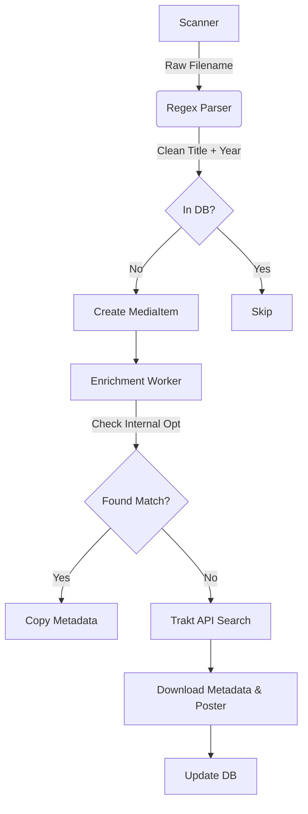

# System Logic: Parsing & Enrichment

This document details the exact algorithms and logic used by CopyCat to parse filenames from Zurg and enrich them with metadata.

## 1. The Pipeline

---

## 2. Filename Parsing (`media_scanner.py`)

### 2.1 Strict Path Typing
Unlike other systems that guess, CopyCat **strictly** determines media type `movie` vs `tv` based on the parent folder path.
- Path contains `/shows/`, `/tv/`, `/series/` -> **TV**
- Path contains `/movies/` -> **Movie**

**Why?** This prevents "The Movie (2020)" from being matched as a show if it happens to look like one, and guarantees the correct Trakt search endpoint is used.

### 2.2 "Garbage" Removal
Before parsing, we clean the filename of common "spam":
1.  **Prefixes:** `www.Site.com -`, `[Group]`, leading hyphens.
2.  **Non-ASCII Filter:** Files containing Russian, Chinese, Japanese, Korean, or Indian characters are **skipped entirely** to maintain a clean English/International library.

### 2.3 Regex Priority System
We use a prioritized list of regex patterns. The **first match wins**.

| Priority | Type | Pattern Logic | Example |
| :--- | :--- | :--- | :--- |
| **1** | TV | `Sxx-Sxx` (Multi-Season) | `Show S01-S03` |
| **2** | TV | `SxxExx` (Standard) | `Show.S01E05.mkv` |
| **3** | TV | `Part X` | `MiniSeries Part 1` |
| **4** | TV | `Sxx` (Season Pack) | `Show.S01.BluRay` |
| **5** | TV | `Season X` (Word) | `Show Season 1` |
| **6** | Movie | `(Year)` | `Movie.Title.2020.mkv` |

### 2.4 Title Cleaning
After extraction, the title goes through a rigorous cleaning process:
1.  **Normalization:** Replace `.` and `_` with spaces.
2.  **Strip Metadata:** Remove technical tags like `1080p`, `BluRay`, `HDR`, `Atmos`, `x265`, `Remux`.
3.  **Strip Editions:** Remove `Extended`, `Director's Cut`, `Unrated` from the *end* of the title.

---

## 3. Enrichment Logic (`enrichment.py`)

### 3.1 Optimization: "Self-Learning"
Before asking Trakt, the system checks its own database.
*   **Logic:** "Do I already have a *successful* enrichment for 'Avatar' (Movie)?"
*   **Result:** If yes, it **copies** the IDs, Overview, Rating, and Poster URL from the existing item to the new file.
*   **Benefit:** Zero API calls for duplicate files or upgrades (e.g., replacing 1080p with 4K).

### 3.2 Trakt Search Strategy
If no local match is found, we call the Trakt API.
1.  **Search:** Query `Trakt` using the Clean Title + Year (if available).
2.  **Type Enforcement:** We search *only* the endpoint matching the file's path type (`/search/movie` or `/search/show`). We do **NOT** swap types on failure (strict mode).

### 3.3 Poster Caching
To respect Trakt's policy and improve speed:
1.  **Download:** The poster image is downloaded to `data/images/`.
2.  **Hash:** Saved with a hash-based filename (e.g., `a1b2...jpg`).
3.  **Audit:** The system records the hash to avoid redownloading the same image for multiple items.

---

## 4. Database Schema
Items are stored in SQLite (`data/list_sync.db`) with clear separation of "Physical" and "Metadata" fields.

-   **Physical (Immutable):** `full_path`, `size_bytes`, `created_at`
-   **Parsed (Mutable):** `title`, `year`, `media_type`
-   **Enriched (Trakt):** `tmdb_id`, `imdb_id`, `overview`, `rating`, `genres`, `poster_url`

